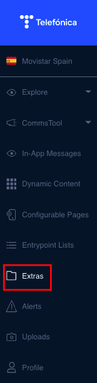

Extras CMS
==========

Acesse o CMS de Extras no menu lateral **Extras** 

\
Se você não tiver acesso, consulte o OBPM de TCX para que possam administrá\-lo.
\

Antes de começar...
-------------------

#### O que é um extra?

Lembre\-se de que um extra é simplesmente um elemento composto por um ícone e um breve texto. 

#### Por que são necessárias as listas de extras?

Para poder criar um extra, é preciso que esse extra esteja incluído em uma lista, pois não pode ser visualizado por si só. De fato, o mais comum é agrupar vários extras sob um título comum e visualizá\-los como uma lista. Mas você poderá aprender tudo isto neste guia.

Podemos começar?

