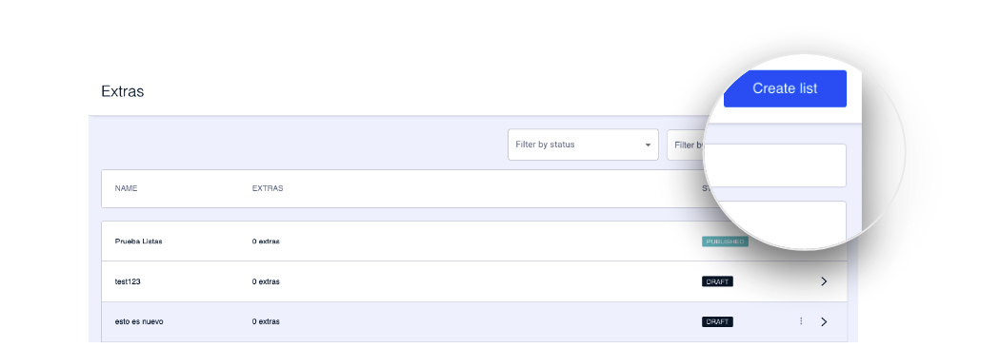

How to create a list
====================

The first step to create an extra is to create a list beforehand. The appropriate extras are then added to this list.

Click on **Create list** to create a list of extras or click on an existing list to include it in that list.

The list creation process is divided into several steps.

**Step 1\. Overview** . In this step you can configure the general information of the list \(Internal name, ID, etc.\).

\{% content\-ref url="overview.md" %\}
overview.md
\{% endcontent\-ref %\}

**Step 2\. Content** . This is where the most visual part of the list is configured and where the extras are managed.

\{% content\-ref url="contenido.md" %\}
contenido.md
\{% endcontent\-ref %\}

**Step 3\. Preview** . The last step serves as a summary. From the Preview step, you can [create a test](../como-hacer-un-test.md) to validate the configuration before impacting a large mass of customers.

\{% content\-ref url="vista\-previa.md" %\}
[vista\-previa.md](vista-previa.md)
\{% endcontent\-ref %\}

