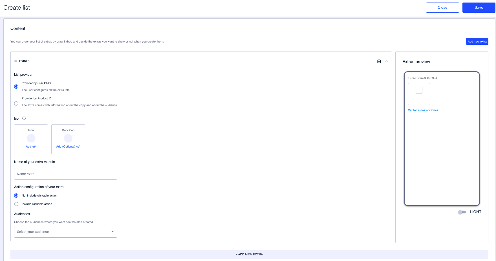

Contenido
=========

The contents of a list of extras are no more than the extras themselves. Use this second step to add them, manage them or delete them if they are no longer necessary.

Click **Add new extra** to add an extra to the list and fill in the required fields:

**List provider**. Indicates where the information to configure the extras in the list comes from:

* **Provider by user CMS**. Select this option to manually configure the extra.
* **Provider by Product ID**. Select this option to indicate a Product ID and receive the extra information via API.


This information should be provided by your development team.


**Icon** 

Add the icon representing the extra. The default version (**Icon**) is mandatory and you have the option to add the **Dark icon**, which would be the icon shown to the user on the app when using *dark mode*.


We recommend uploading both versions of the icon in SVG format. PNG format is also supported.


**Name of the extra module** . Name of the extra that appears under the icon. 


:bulb: We recommend using a very short name. Otherwise, the name will be cut off.


**Action configuration of your extra** 

* **Not include clickable action**. Select this option, which is checked by default, if you don't want the icon + text of the extra to be clickable.
* **Include clickable action**. Check this option to make the icon + text of the extra clickable and to set the URL to which the user is directed by clicking on it. 
  * **Action navigation to**: 
    * **URL**. Select this option to manually include a URL. Indicates the URL to which the user is directed by clicking on the extra in the Web address field.
    * **Preconfigured**. Select this option to choose a specific point in the app. Indicates the specific point in the drop-down menu.

**Audiences**. Select the audience to which the user must belong in order to see the extra.


🤓Please note that you can have extras configured for different audiences within the same list of extras. Obviously, this is not a problem. However, it is important that you remember it because the user must belong to this audience when you run the test(s) that are required for an extra to be seen.


If you need to add more extras, click on the **Add new extra** button and repeat the steps described in this section.

Click **Continue** to proceed to the last step.

