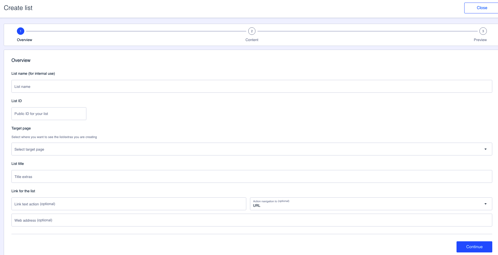
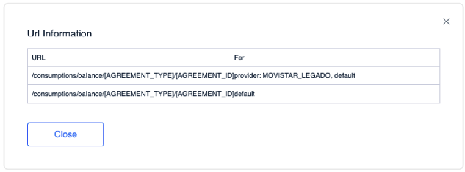

Overview
========

In this first step, it provides general information about the list.

Fill in the fields below:

**List name \(for internal use\)** . The name of the list that you are creating. This is a field for internal use, so it is not visible in the app at any time. 

**List ID** . This field is automatically populated when you fill in the **List name \(for internal use\)** field. You can change the default value. However, please note that this field does not support spaces, accents or other special characters. 

**Target page** . Select the target page on which the list you are configuring will be displayed.

**List title** . Indicates the title of the list. This title is the one shown to users of the app. This title appears at the top of the extras group.

**Link for the list** . You have the option to add a link to the list. Configure:

* **Link text action** . This is the text that will be clickable
* **Action navigation to** . Here you can select one of the two available options: 
  * **URL** . Manually enter, in the Web address field, the URL the user will be directed to when clicking on the text \(the one you entered in **Link text action** \). 

  * **Preconfigured** . Use one of the predefined URLs that take the user to specific points in the app.

    If you click on **View ID information** you can consult the complete URL that corresponds to the selection you have made.

Click on **Continue** to proceed to the next step.

