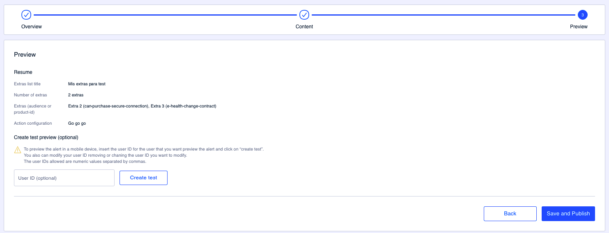
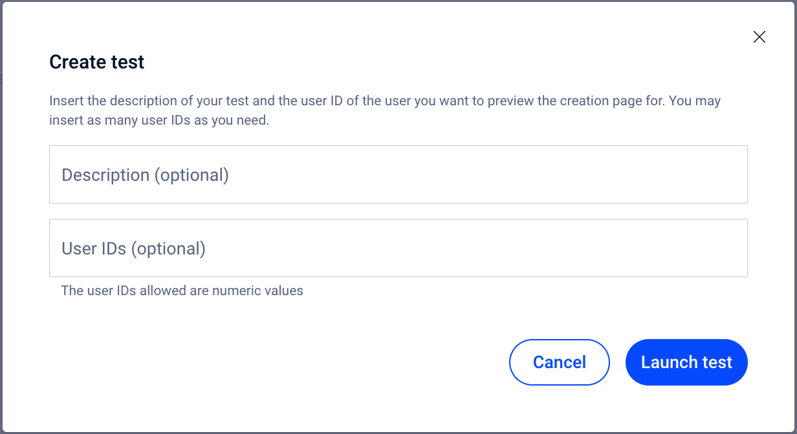

# Vista previa

En este último paso dispones de un resumen de la lista de extras que has configurado.

Además, es desde este paso desde donde puedes iniciar un test para probar el contenido antes de impactar a los usuarios.

Este paso te da información sobre:

* **Extras list title**. Título de la lista de extras bajo la que se muestran los extras.
* **Number of extras**: Número de extras que tiene en total la lista, aunque esos extras no estén activados (visibles).
* **Extras (audience or product-id)**: Listado de los extras, por nombre, que contienen la información de la audiencia o del product ID entre paréntesis.
*   **Action configuration**. Si la lista de extras tiene configurado un enlace entonces se muestra aquí la información correspondiente.

    👋🏻 Recuerda que este campo es opcional.

Haz clic en **Save** para guardar los campos o haz clic en **Save and Publish** para guardar y publicar los cambios.

### Cómo crear un test

Desde este último paso puedes también crear un test para probar el contenido que has configurado antes de impactar a una amplia masa de usuarios.

#### Test information

Haz clic en **Create test** para comenzar un test.&#x20;

<figure><figcaption></figcaption></figure>

* **Description (optional)**. Usa este campo para describir los cambios o el contenido que quieres probar. Es un campo opcional pero es un muy recomendable que lo rellenes porque te ayudará a identificar rápidamente el test que estás creando.
* &#x20;**User IDs (optional)**. Añade uno o más user IDs, separados únicamente por comas (sin espacios), en los que quieras hacer las pruebas. Este campo solo admite valores numéricos.

Haz clic en **Launch test** para comenzar el test y poder probar el contenido.


**Cómo obtener el user ID**

1. Asegúrate de tener descargada la versión Enterprise de la app.
2. Abre la app
3. Agita el teléfono
4. Accede a la sección "Autentication"
5. el número que necesitas es el del campo **User ID**


¿Necesitas más información sobre cómo probar el contenido? 👇🏼


[como-hacer-un-test.md](../como-hacer-un-test.md)

