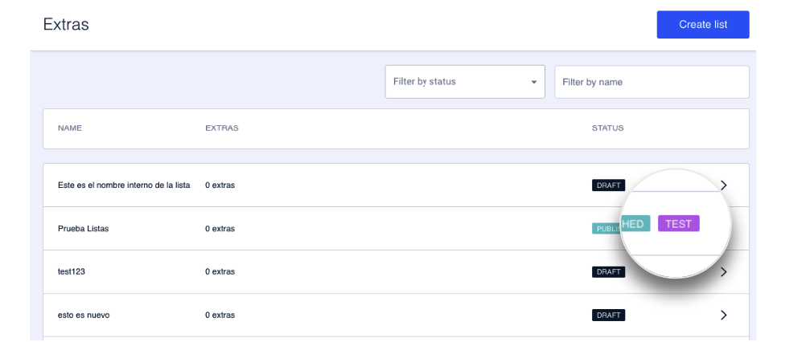
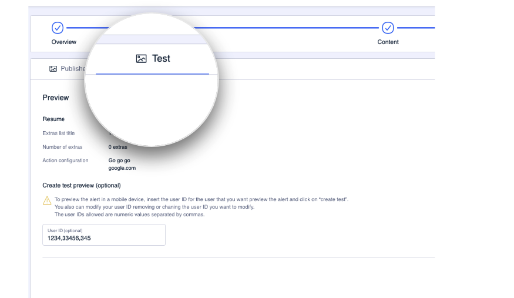
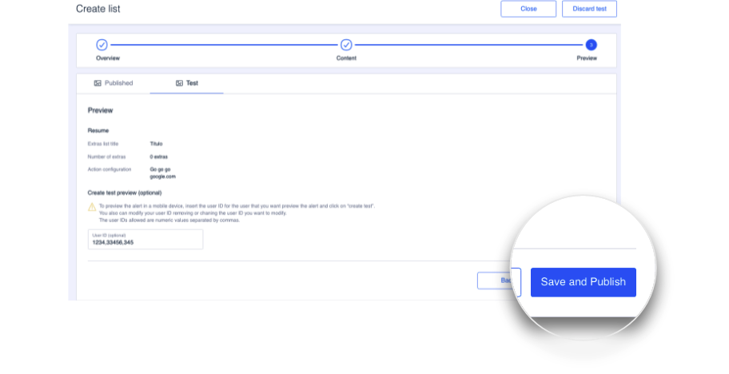
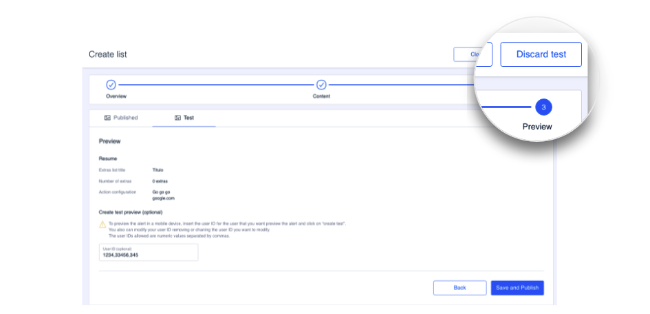

How to perform a test
=====================

Although you have already been shown how to start a test in the [Preview](como-crear-una-lista/vista-previa.md#como-crear-un-test) section, you can learn more about this content testing process below:

### How to publish the content of a test

To begin with, you will know that a test is ongoing for a list of extras thanks to the **TEST** status label:

To publish the content of a test, access the list of extras for which that test is running.

When you open the list, the content appears divided into two tabs. This allows you to see, at all times, the content prior to the test and the content of the test itself.

\{% hint style="warning" %\}
You can only make changes to the content if you are in the **Test** tab. Use the other tab to view the content prior to the changes you have introduced for the test. 
\{% endhint %\}

When you are happy that the content in all steps of the **Test** tab is the content you want to apply, click **Save and Publish** . Click **Yes** in the confirmation message.

Click **Close** to return to the main **Extras Lists** screen.

\{% hint style="success" %\}
:thumbsup: On the main screen, you can see that the **TEST** label is no longer shown in the list status.
\{% endhint %\}

### How to delete a test

If you decide to discard the changes after testing the content of an extras list, you need to access the extras list that the ongoing test applies to.

Click **Continue** until you reach the **Preview** , which is the last step. Then, click **Discard test** .

When you discard a test, all the changes that you had made to the extras list and the extras themselves will be deleted. The content will then be created as it was previously, prior to the test.

### How to add, remove or modify the Novum User IDs of a test

If you need to edit the test in order to add, remove or modify the users who can view a certain test, you need to access that list.

In the **Test** tab you can consult, in the first step \( **Overview** \), the information related to the test: its description, who started it and the date on which it was created.

Go to the final step \( **Preview** \) to modify the user numbers. At this step, you can also add new user IDs or delete existing ones. Simply edit the values in the **User ID \(optional\)** field and click **Save and Publish** to save the changes.

