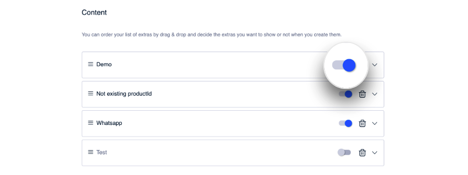
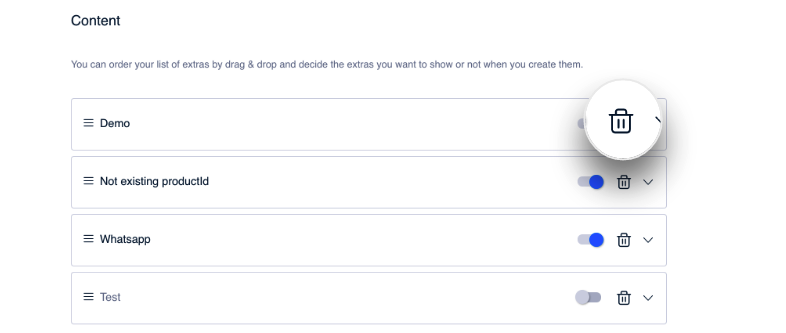

Gestão de Extras
================

Como você pode observar, é no passo [Conteúdo](como-crear-una-lista/contenido.md) onde são configurados os extras. Mas além de sua criação e configuração, aqui também poderá gerenciá\-los: excluir um extra, mudar a ordem de exibição dentro da lista...

### Ativar/Desativar um extra

Você pode modificar a visibilidade do extra. Por padrão, quando um extra é criado, ele aparece ativado. Ou seja, ele será visível para o usuário que cumpre as condições necessárias para vê\-lo, isto é, ele pertence ao público para o qual o extra é configurado.

Se por algum motivo você prefere ocultar esse extra, use o controle para desativá\-lo. 

Da mesma forma, ative um extra desativado para que apareça novamente.

Clique em **Save** para salvar as mudanças. Observe que se a lista está publicada, salvar as mudanças também significa publicá\-las, embora o sistema solicitará a confirmação.

### Excluir um extra

Se você tem certeza absoluta de que não quer exibir novamente o extra e deseja eliminá\-lo, clique em .

\{% hint style="warning" %\}
Observe que **apagar um extra** de uma lista é uma **ação irreversível** . 

:nerd:Se você não tiver certeza, é recomendável que em vez de eliminar o extra, ele seja desativado.
\{% endhint %\}

### Mudar a ordem

A ordem em que são exibidos os extras pode ser controlado no CMS. Isto é tão simples quanto fazer *drag&drop* , isto é, arrastar e soltar até a posição desejada.

Em primeiro lugar, são mostrados os que estão no topo.

